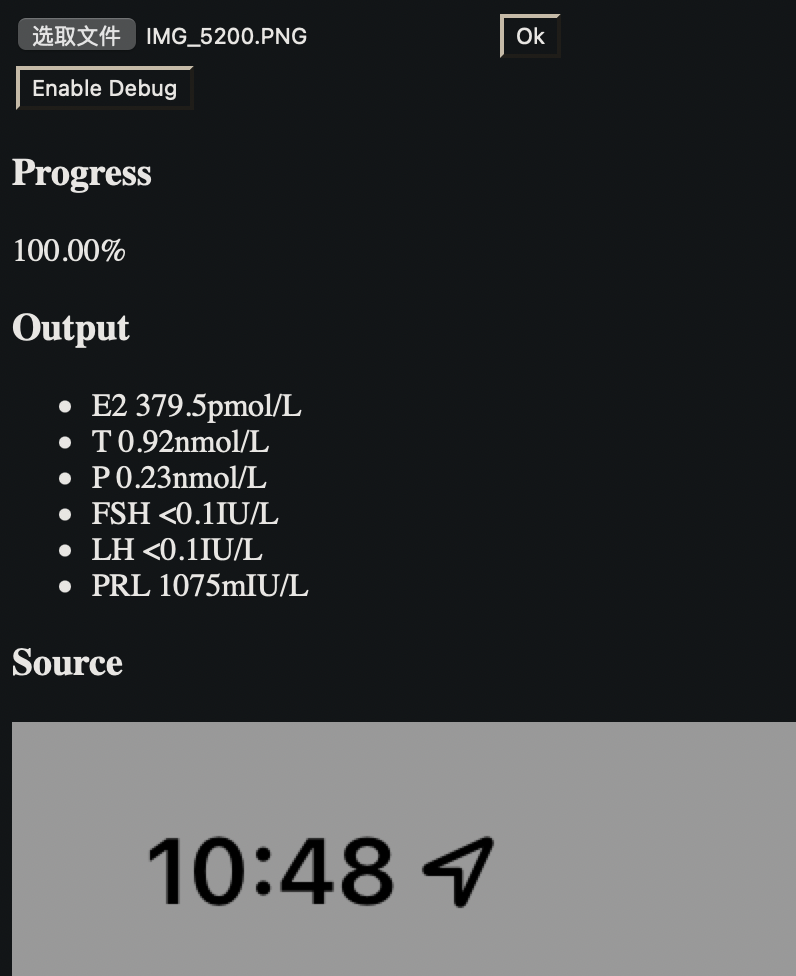

# Hormones Toolkit

> WIP: Early stage and highly experimental.

Hormones toolkit is a web app that can recognize sex steroids data from your online medical record, and convert units if
needed (not implemented yet).

You upload the screenshot and get your report imported and data transformed.

## Known supported platforms

### OS

- iOS

### Hospitals

- The NO.10 People's Hospital of Shanghai
- The First Affiliated Hospital of College of Medicine, Zhejiang University

## Privacy

This app runs locally and won't upload any data.

## Early Demo

## License

MIT

<!--suppress HtmlDeprecatedAttribute -->

&mdash;💖&mdash;

<i>Built with love by LightQuantum</i>
